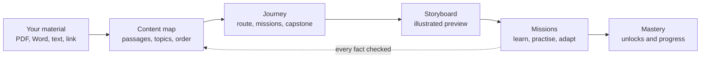

# Gamora

**Turn anything you want to learn into a short, story-driven learning journey that teaches only from your material, adapts to you as you go, and never gives you a test.**

Live app: **https://gamora-web.vercel.app**

---

## What is Gamora?

Most of what people learn from is material they already have: lecture notes, a textbook chapter, an article, a policy, a PDF someone shared. Reading it is passive. Quiz apps do not know what is in it. General chatbots do, if you paste it in, but they drift away from it, sometimes invent facts, and do not keep track of what you actually understood.

Gamora sits in between. You give it your material, and it builds a guided journey out of it:

1. **A map of the topics.** The material is split into passages, the teachable ideas are found, and they are grouped into a manageable number of topics in a sensible learning order. Every topic stays linked to the exact passages it came from.
2. **A preview.** An illustrated storyboard walks through the whole journey, one panel per topic, each quoting your material.
3. **Missions.** Each topic is taught first, then practised through situations to act in: decisions, spotting the mistake, putting steps in order, role-plays, explaining an idea back, quick flashbacks, a Crossroads choice that changes what happens next, and a closing Capstone case that needs several topics at once.
4. **Progress without tests.** Gamora estimates what you understand from how you answer, fix your own mistakes and remember earlier ideas. Missions unlock as that understanding shows.

It is built for **individual self-learners**: students, working professionals, career switchers and anyone learning for their own reasons, in **English or Roman Urdu**, by **voice or text**.

## Highlights

| | |
|---|---|
| **Grounded in your material** | Every fact is cited and checked against the source. If the material does not cover a question, Gamora says so instead of guessing. |
| **Adapts, and says why** | Challenge, pace, support and language change with your answers. Each change comes with a short "Why this changed" note, and a Tuning panel always shows the current settings. |
| **Four ways through** | Narrative (one continuing story), Scenarios (situations to act in), Quick scan (a light pass over everything) or Focus (one topic at a time with worked examples). |
| **Fifteen ways to see a lesson** | Notes and flow plus 13 diagram views such as side by side, share split, trend bars, loop, quadrant and cause chain. A view is offered only when the material has the data for it, and numbers are never invented. |
| **Mastery without tests** | Every answer is evidence. Two clean answers unlock the next mission, three master a topic, and knowledge fades slowly without practice. The full calculation is in [docs/MASTERY.md](docs/MASTERY.md). |
| **Voice and hands-free** | Speak your answers, have replies read aloud in a South Asian English voice where the device has one, or go fully hands-free: Gamora reads each step and listens for "next", "hint", "repeat", an option or your answer. |
| **Game elements with purpose** | XP only for meaningful actions, levels, streaks with a grace day, stars per mission and badges for things like fixing your own answer or clearing a Capstone case without a hint. |
| **Friendly to real material** | Long documents are grouped into at most 12 topics by default (your choice, up to 30), each keeping its finer ideas as key points. |
| **Accessible** | Text-only mode, high contrast, keyboard navigation, reduced motion, a phone layout, and a guided tour for first-time users. |
| **Honest when busy** | When a free AI service is at its limit, Gamora switches to a backup and tells you, rather than going silent. |

## How it works



- **One application, no servers to run.** Gamora is a single Next.js app. Its backend is a set of API routes that run as serverless functions on Vercel, so nothing runs when nobody is using it and it scales on its own.
- **Long work in short steps.** Reading a long PDF happens as a series of short, resumable steps, so it fits within serverless time limits and can safely retry.
- **Rules decide, the model writes.** How difficulty and pace change is decided by a small, tested rule table in code. The language model only writes the content: lessons, situations, feedback. This keeps adaptation predictable and explainable.
- **Checked before shown.** Generated content cites the passages it relies on and is checked against them by a second model. Anything that fails is rewritten once, then replaced by teaching straight from the source.
- **Resilient on free tiers.** Model calls go through one router that tries several contributor keys and several providers (Groq, then Gemini, then OpenRouter), caches repeated work and prepares the next step while you read.

A deeper tour of the architecture, the request flow, the data model and the reasoning behind each technology choice is in [docs/PROJECT_OVERVIEW.md](docs/PROJECT_OVERVIEW.md).

## Built with

| Area | Technology |
|---|---|
| App | Next.js 16, React 19, TypeScript, Tailwind CSS 4 |
| Data and sign-in | Supabase (Postgres with row-level security, Auth) |
| Cache and rate limits | Upstash Redis |
| Language models | Groq (gpt-oss 20b and 120b), Google Gemini, OpenRouter |
| Voice | Browser speech recognition and synthesis, Whisper as a fallback |
| Quality | Zod validation, Vitest, Playwright, GitHub Actions |
| Monitoring | Sentry and a structured events log |
| Hosting | Vercel and Supabase free tiers |

## How it was developed

Gamora was built in a short, milestone-driven sprint, working from a written specification rather than feature by feature.

- **Specification first.** A product spec, an architecture document and a set of non-negotiable rules came before any code: every fact must be grounded, uploaded content is data and never instructions, adaptation must explain itself, and personal data is kept to a minimum.
- **Milestones with exit criteria.** Work moved through nine milestones, from foundations and security to ingestion, the journey planner, the tutor loop, gamification, voice and Roman Urdu, admin and dashboards, and finally hardening. Each ended with a working deployment and a concrete check, for example "a 10-page PDF becomes a concept map in under 45 seconds" or "an admin changes a setting and the next turn follows it".
- **Decisions written down.** Architecture decision records capture the important choices and their trade-offs: one app instead of separate services, models chosen by evaluation, Roman Urdu instead of Urdu script, rules for adaptation, and a simple, explainable mastery model.
- **Measured, not assumed.** Model choices came from a Roman Urdu bake-off. Grounding is checked by an evaluation suite (30 of 30 generated claims supported by the source, 10 of 10 out-of-scope questions declined), adaptation by scripted learner traces, and a provider outage drill confirmed the fallback.
- **Tested and deployed continuously.** More than 150 automated tests run on every push, and every push to the main branch deploys to production. An end-to-end check drives a throwaway learner through the whole journey against the live site.
- **Improved from real use.** Production logs shaped later work: grouping long documents into topics, fairer mastery scoring, faster fallback between AI providers, and notices when the AI is busy.

## Run it yourself

You need Node.js 22, pnpm 10, a Supabase project, an Upstash Redis database, and API keys for Groq and Gemini (OpenRouter is optional).

```bash
pnpm install
cp .env.example .env.local   # fill in your keys
supabase db push             # create the database tables
pnpm dev                     # http://localhost:3000
```

Useful commands: `pnpm test` (unit and route tests), `pnpm lint`, `pnpm typecheck`, `pnpm build`. Operational queries for the database are collected in [docs/SUPABASE_QUERIES.md](docs/SUPABASE_QUERIES.md).

## Project structure

```
src/app            pages (Studio, journeys, missions, storyboard, admin) and API routes
src/components     interface pieces: diagrams, storyboard player, tuning panel, tour
src/lib/ingest     reading files, splitting, finding concepts, grouping into topics
src/lib/planner    turning topics into a journey for the chosen route
src/lib/tutor      lessons, activities, evaluation, adaptation rules
src/lib/learner-model  the mastery estimate
src/lib/grounding  checking content against the source
src/lib/llm        the model router, key pool and caching
src/lib/voice      speech in and out, voice commands
supabase/migrations  database schema and access rules
docs               project overview, mastery calculation, database queries
```

## Privacy

Audio is never stored. Logs use hashed identifiers, dashboards are pseudonymised, every table is protected by row-level security, and learners can delete their account and all their data from the profile menu.

## Limitations

- Mastery is an explainable estimate built from learning evidence, not a psychometrically validated score.
- Roman Urdu quality depends on the free models available and would benefit from review by native speakers.
- Read-aloud uses the voices on your device; a true Urdu voice is not used because Gamora writes in the Latin alphabet.
- Free AI tiers limit requests per minute, so replies can be slower at busy times.
