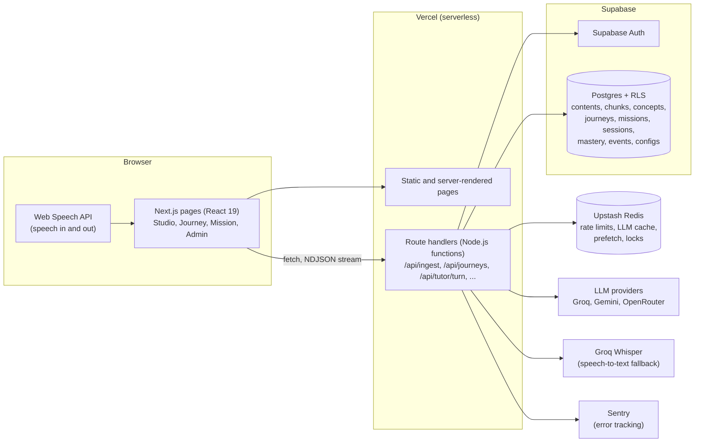
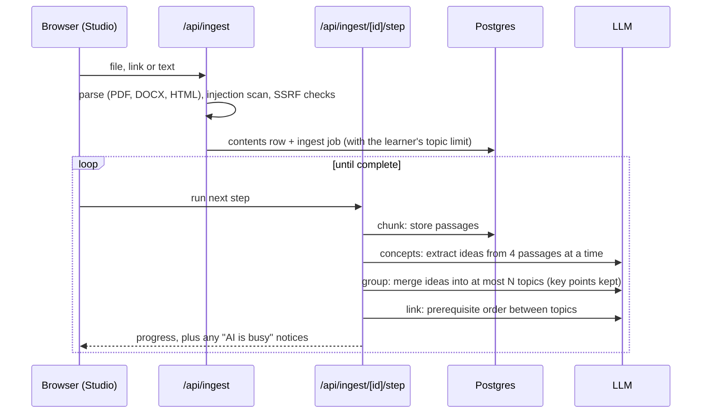

# Gamora: project overview

This document explains Gamora twice: first in plain language (what it is, who it is for, what a learner experiences), then technically (how it is built, where it runs, and why each tool was chosen over its alternatives). It is written so you can present the project with confidence and answer detailed questions about it.

Live app: https://gamora-web.vercel.app

---

## Part 1: Gamora in plain language

### The one-line pitch

Gamora turns your own learning material into a short, game-like learning journey that teaches only from that material, adapts to you as you go, and never gives you a test.

### The problem it solves

Most people learn from material they already have: lecture notes, a textbook chapter, a policy document, an article, a PDF someone shared. Reading it is passive, and generic quiz apps do not know what is in it. General chatbots do, if you paste it in, but they wander off the material, invent facts, and do not track what you have actually understood.

Gamora sits in between. It reads your material, breaks it into topics, and builds a guided journey out of it: a preview, lessons, practice situations, and a record of what you have shown you understand. Every fact it teaches comes from your material and can be traced back to the exact passage.

### Who it is for

Individual self-learners: students, working professionals, people switching careers, and anyone learning for their own reasons. It supports English and Roman Urdu (Urdu written in the Latin alphabet), including mixed "code-switching" messages, and it works by voice as well as text.

### What a learner experiences, step by step

1. **Sign up and a short intro chat.** The guide (called Sagar) asks who you are, what you want to get better at, how familiar you already are with the subject, how much time you have, and which language feels natural. This sets your starting challenge level, pace and language.
2. **Add material in Studio.** Paste text, give a web link from a supported site, or upload a PDF, Word or text file.
3. **Gamora builds a content map.** It splits the material into passages, finds the teachable ideas, groups them into a manageable number of topics (12 by default, adjustable per learner), and works out which topics depend on which. You see this as an interactive map.
4. **Build a journey and pick a route.** Narrative (one continuing story), Scenarios (situations to act in), Quick scan (a fast pass over everything) or Focus (one topic at a time with worked examples).
5. **Watch the storyboard.** An illustrated preview of the whole journey, one panel per topic, each with a diagram and a quote from your material.
6. **Play the missions.** Each topic starts with a short lesson you can view in different ways (notes, flow, charts, comparisons and more). Then you practise: open questions, decisions, spotting the mistake in a process, putting steps in order, role-plays, teaching an idea back, quick flashbacks, a Crossroads decision that changes what happens next, and a closing Capstone case that needs several topics at once.
7. **Gamora adapts.** It raises or lowers the challenge, adds a worked example when you struggle, keeps things short when you are rushed, and follows you into Roman Urdu if you write in it. Every change comes with a short "Why this changed" note, and the Tuning panel always shows the current settings.
8. **Progress without tests.** Mastery per topic is estimated from how you answer, fix your own mistakes and remember earlier ideas. The next mission unlocks when you have shown enough understanding. XP, levels, streaks, stars and badges reward meaningful effort, never clicking.

### What makes it different

| Idea | What it means for the learner |
|---|---|
| Grounded | Every fact is checked against your material. If the material does not cover a question, Gamora says so instead of guessing. |
| Adaptive, and says why | The rules that change difficulty are visible and explained, not a black box. |
| No quizzes | Understanding is inferred from real answers, choices, corrections and recall. |
| Story first | A storyboard previews the journey; missions continue the same story and people. |
| Many ways to see an idea | Thirteen diagram views on top of notes and flow, offered only when the material supports them. |
| Voice and hands-free | Speak answers, have replies read aloud, or go fully hands-free. |
| Honest when the AI is busy | A short notice explains a slow reply, and a backup model or a source quote keeps you moving. |

### A two-minute demo path

1. Home: show the "Take the tour" prompt and the journeys list.
2. Studio: paste or upload a document, watch the steps (read, split, find concepts, group into topics, map the order), then open the map.
3. Build a journey with the Narrative route. Play the storyboard for two panels.
4. Open mission 1. Show the lesson and flip "View as" between two views. Answer one question well and one badly, and point at the "Why this changed" note and the Tuning panel.
5. Ask a question the material does not cover and show the honest "not in your material" answer.
6. Admin: show the dashboard (mastery heatmap, funnel, grounding pass rate, replies rated useful) and the versioned configuration.

---

## Part 2: How it is built

### Architecture at a glance

One Next.js application holds both the user interface and the backend. There is no separate server to run: the backend is a set of route handlers that Vercel runs as serverless functions. Data lives in Supabase (Postgres), short-lived state and rate limits live in Upstash Redis, and the AI comes from hosted language model APIs.

### Server-based vs serverless, and what Gamora uses

**Server-based** means you rent a machine (or container) that runs your backend process all the time. It keeps memory between requests, you pay for it even when idle, and you scale it yourself. Examples: a Node or Python server on a VPS, AWS EC2, Render, Railway, or a Docker container on Kubernetes.

**Serverless** means you upload functions and the platform runs a copy of each function only when a request arrives. You pay per use, it scales automatically (many copies run in parallel under load), and there is nothing to patch or keep alive. The trade-offs: an idle function may take a moment to start (a "cold start"), each call has a time limit, and memory is not guaranteed to survive between calls.

**Gamora is serverless.** Concretely:

- **Pages** are built by Next.js. Some are static (prerendered at build time, served from Vercel's edge cache), others render on demand.
- **Every file under `src/app/api/**/route.ts` becomes a serverless function** on Vercel's Node.js runtime, deployed to one region (`icn1`, Seoul, set in `vercel.json`). Heavy routes declare `maxDuration = 60` seconds.
- **The functions are stateless.** Anything that must persist goes to Postgres (Supabase). Anything short-lived but shared between function copies goes to Redis (Upstash): rate limit counters, a cache of model replies, the next activity prepared in advance, and locks that stop two requests building the same thing.
- **Work that is too long for one call is split into steps.** Reading a 100-page PDF can take minutes, far beyond one function call. So ingestion is a resumable job: the browser calls `POST /api/ingest/<id>/step` repeatedly, and each call does one step (split into passages, one batch of concept extraction, grouping into topics, linking). The job's progress is saved in the `ingest_jobs` table, so any step can be retried safely.
- **Replies stream.** A tutor turn is a single HTTP response that sends newline-delimited JSON events (NDJSON) as they become ready: feedback first, then the mastery change, XP, and the next activity. The learner sees feedback while the next activity is still being generated.
- **Background work uses `after()`.** Next.js's `after()` runs code after the response has been sent: prefetching the next activity, and building the storyboard while the learner reads the journey map.

Why serverless fits this project: no server to maintain, free-tier hosting, automatic scaling for a demo that may get sudden traffic, and deploys that happen on every push to GitHub. The cost is some design discipline (stateless functions, stepwise jobs, Redis for shared state), which the architecture above already absorbs.

### Request walkthroughs

**Adding material (ingestion)**

**Building a journey**: the planner orders the topics by their prerequisites (Kahn's algorithm), asks the reasoning model to design missions for the chosen route and the learner's profile, repairs gaps (every topic gets at least two chances to show understanding), appends a Capstone case, and saves missions. A deterministic plan is used if the model fails. The storyboard is then built in the background.

**A tutor turn** (`POST /api/tutor/turn`, streamed):
1. Load the mission, the journey, the learner's profile and the saved session state.
2. For an answer: evaluate it (choices are scored in code; open answers by the model against the expected points and the source), turn the result into evidence signals, update mastery, award XP and badges.
3. Run the adaptation rules (`src/lib/tutor/policy.ts`) to set the next difficulty, pace, style and language, with a human-readable reason for each change.
4. Present the next step: from the prefetch cache if ready, else generate it, verify its claims against the source, regenerate once if the check fails, and fall back to quoting the source if it fails twice.
5. Stream each event to the browser as it is ready.

### Tech stack, with the reasoning and alternatives

| Layer | Choice | Why | Common alternatives |
|---|---|---|---|
| Language | TypeScript (strict) | One language for UI and backend, types catch mistakes early | JavaScript, Python backend + JS frontend |
| Framework | Next.js 16 (App Router, Turbopack) | UI, server rendering and API routes in one project and one deploy | Remix, SvelteKit, Nuxt, or React + Express/FastAPI |
| UI library | React 19 | The standard for Next.js; large ecosystem | Vue, Svelte, Solid |
| Styling | Tailwind CSS 4 with design tokens | Fast, consistent styling; high contrast via CSS variables | CSS Modules, styled-components, plain CSS |
| Diagrams | Hand-written SVG and HTML components | No chart library needed; every view is accessible and themeable | Recharts, Chart.js, D3, Mermaid |
| Concept map | React Flow + dagre | Interactive graph with automatic layered layout | Cytoscape.js, vis-network, D3 force |
| Validation | Zod 4 | Every API input and every model reply is validated at runtime | Yup, Valibot, io-ts |
| Hosting | Vercel (serverless functions) | Zero-ops, deploy on git push, free tier, native Next.js support | Netlify, Cloudflare Pages/Workers, AWS Lambda + Amplify, Render, Fly.io, a VPS |
| Database | Supabase Postgres | Real SQL with row-level security, full-text search, free tier, managed | Neon, PlanetScale (MySQL), Firebase Firestore, MongoDB Atlas, self-hosted Postgres |
| Auth | Supabase Auth (email and password) | Same platform as the data; tokens verified on every request | Clerk, Auth0, NextAuth/Auth.js, Firebase Auth |
| Cache and rate limits | Upstash Redis + @upstash/ratelimit | HTTP-based Redis that works from serverless functions | Vercel KV, Cloudflare KV, Redis Cloud, in-database counters |
| Language models | Groq (gpt-oss-20b fast, gpt-oss-120b reasoning), Gemini flash-lite, OpenRouter free models | Fast free tiers; providers chained for resilience | OpenAI, Anthropic Claude, Mistral, Cohere, self-hosted Llama via Ollama or vLLM |
| Speech to text | Browser Web Speech API, then Groq Whisper | Free and instant in Chrome and Edge; Whisper covers other browsers | Deepgram, AssemblyAI, Google Speech, Azure Speech |
| Text to speech | Browser speechSynthesis | Free, offline-capable, no audio leaves the device | ElevenLabs, Azure TTS, Google TTS |
| File parsing | pdf-parse (PDF), mammoth (DOCX), own HTML-to-text | Pure JavaScript, runs inside a serverless function | Apache Tika, unstructured.io, LlamaParse |
| Errors | Sentry | Stack traces with request IDs, client and server | Datadog, New Relic, LogRocket |
| Tests | Vitest (unit, route, eval), Playwright (end to end) | Fast TypeScript-native tests; real-browser checks | Jest, Cypress |
| Package manager | pnpm | Fast, strict dependency resolution | npm, yarn, bun |
| CI | GitHub Actions: lint, typecheck, test | Runs on every push and pull request | GitLab CI, CircleCI |

### The AI layer in detail

- **One interface, several providers.** Every model call goes through `generateWithFallback` in `src/lib/llm/router.ts`. Feature code asks for a task ("fast" or "reasoning"), never a model name.
- **Provider chain.** Groq first (fastest), then Gemini, then OpenRouter, configured by environment variables. If a provider fails or refuses a request, the next one is tried. Within a provider, the other model is tried too.
- **Key pools.** Several team members contribute their own free-tier keys (`GROQ_API_KEY`, `GROQ_API_KEY_SUM`, `GROQ_API_KEY_EDU`, ...). A key that hits its rate limit rests until its window resets and the next key takes over. Logs name the key's owner label, never the key.
- **Why it sometimes feels slow.** Free tiers limit tokens per minute (Groq: about 8,000 per model per key) and occasionally overload (Gemini returns "503, model overloaded"). A request that needs a backup takes longer. Gamora now tells the learner when this happens (a short notice) and keeps prompts small enough to avoid "request too large" refusals.
- **Caching.** Replies to identical prompts (concept extraction, linking, planning) are cached in Redis for a week, which makes re-uploads and repeated plans instant.
- **Structured output.** Models are asked for JSON; replies are repaired if slightly malformed and then validated with Zod. Anything that fails validation falls back to deterministic code.
- **Every call is logged** to the `events` table with purpose, provider, model, latency, tokens and estimated cost, which feeds the admin dashboard.

### Grounding: how Gamora avoids making things up

1. **Retrieval without embeddings.** Each topic stores the IDs of the passages it came from. A step uses those passages first, then Postgres full-text search on the topic name to fill up to four passages.
2. **Cite or abstain.** Prompts require every fact to cite a passage reference (S1, S2, ...). Answers to learner questions that do not cite anything are replaced by an honest "the material does not cover that".
3. **Verifier.** A second model call checks each claim against the passages (strict by default). A step that fails is regenerated once; if it fails again, Gamora teaches straight from the source text and labels it "Quoted straight from your source".
4. **Deterministic checks.** Diagram numbers and dates must literally appear in the source; storyboard quotes must match the source word for word; narration with a number the source does not state is replaced.

### Adaptation and mastery, with the actual numbers

**Adaptation** is a rule table in code (`src/lib/tutor/policy.ts`), not the model:

| Rule | Trigger | Effect |
|---|---|---|
| Raise | Two answers in a row right without hints (sensitivity "medium") | Challenge +1, brisk pace |
| Lower | Two misses in a row, or two or more hints | Challenge -1, worked example, guided choices |
| Shorten | Slow and very short replies | Brisk pace, options to pick from |
| Language | Learner writes in Roman Urdu | Tutor switches to Roman Urdu |
| Recover | Right again after a struggle | Back to open questions |
| Self-correction | Learner fixes their own answer | Level kept, effort acknowledged |
| Revisit | Overconfident reflection | A later flashback on that idea |

**Starting challenge** follows the intro-chat answer "How familiar are you with the material?": brand new starts at the admin default (2), "I know some of it" at 3, "I know it well" at 4. Learner types such as "Short on time" or "Slow connection" change pace and format, not difficulty.

**Mastery** per topic is a number from 0 to 1 (`src/lib/learner-model/mastery.ts`):

- Each answer produces evidence signals: correct, partial, wrong, hint used, self-corrected, transfer (used the idea in a new situation), recall success or fail, teach-back, calibrated or overconfident.
- Each signal moves mastery by `weight x strength x step` (step 0.35 by default). Gains shrink as mastery rises (by up to half); losses shrink as confidence in the estimate grows.
- A partly right answer counts in proportion to how right it was.
- Mastery fades slowly with time (2% per day) so revisiting keeps it fresh.
- Thresholds (admin-editable): the next mission unlocks at 50%; a topic counts as mastered at 80%.
- In practice: one clean correct answer gives about 35%, two give about 64% (unlocks the next mission), three give about 88% (mastered).

### Gamification

XP only for meaningful actions (correct 20, partial 10, self-correction 15, teach-back 25, mission 50; lessons and clicks give nothing), a level every 200 XP, day streaks with a grace day, one to three stars per mission from mastery, and ten badges (First Steps, Sharp Eye, Second Look, The Explainer, Cool Head, Steady Hand, Solid Ground, Honest Check, Capstone Cleared, Pathfinder). No leaderboard by default.

### Data model (Supabase Postgres)

| Table | Holds |
|---|---|
| `profiles` | One row per user: role (learner or admin), persona, language, time budget, onboarding answers, own topic limit |
| `contents` | A source: title, type, status, language, passage count, topic limit used, shared flag |
| `chunks` | The passages of a source, with a generated full-text search column |
| `concepts` | Topics, with summary, difficulty, source passage IDs, key points, and a retired date after a re-group |
| `concept_edges` | Prerequisite and related links between topics |
| `ingest_jobs` | Progress of the stepwise ingestion job |
| `journeys` | A learner's journey on a source: title, language, route, plan and storyboard |
| `missions` | The missions of a journey: topics, planned activities, unlock rule |
| `sessions` | A learner's run of a mission, including the tutor state machine |
| `turns` | Every message in a session, so a reload replays the conversation |
| `evidence_events` | Each evidence signal, for audit and dashboards |
| `mastery` | Current mastery and confidence per learner and topic |
| `gamification` | XP, streaks, badges and counters per learner |
| `configs` | Versioned admin configuration; one is active |
| `events` | Structured log: model calls, grounding checks, adaptations, errors, ratings |

Every table has row-level security: learners can read and change only their own rows; admins can see everything. The server uses the service role key and checks the user and role on every route itself as well.

### Security and privacy

- Uploaded content is treated as data, never instructions: it is wrapped in delimiters, scanned for prompt-injection patterns, and refused if it looks like instructions to an AI.
- Web links are checked against an allowlist and against private or local network addresses (SSRF protection), on every redirect.
- Rate limits per user (Upstash): uploads 20 per hour, tutor 30 per minute, a daily model budget of 600 calls.
- Security headers including a Content Security Policy; secrets only in environment variables.
- Data minimisation: no raw audio is stored, users are pseudonymised in analytics, and "Delete my data" removes the account and everything tied to it.

### Configuration without redeploying

Admins edit a versioned configuration (`/admin/config`): starting level, personas, language rules, tone, difficulty range, which activity types appear, XP values, mastery thresholds, grounding strictness, blocked topics, allowed sites, topic limits, and switches for the storyboard, Capstone case and Crossroads. Each save is a new version with a note and a diff; rollback is one click. Changes apply on the next request.

### Observability

- `events` table: every model call, grounding check, adaptation, mission completion, rating and error, with a request ID.
- Admin dashboard: mastery heatmap, engagement funnel, friction points, pre/post mastery, adaptation reasons, usage and estimated cost, latency, grounding pass rate, replies rated useful. CSV export and a printable report.
- Sentry for exceptions; `/api/health` for a quick status check.

### Testing, CI and deployment

- 144 unit and route tests (Vitest) covering ingestion safety, topic grouping, diagram rules, storyboard grounding, planner routes, policy rules, mastery, voice commands and more; separate evaluation tests for grounding and Roman Urdu.
- Playwright smoke and walkthrough tests in a real browser.
- GitHub Actions runs lint, typecheck and tests on every push.
- Deployment: pushing to `main` triggers a Vercel production build automatically. Database changes are SQL migrations in `supabase/migrations`, applied with `supabase db push`.

### Known limitations and next steps

- Free model tiers are the main source of slowness; a paid tier or a self-hosted model would remove most waiting.
- No semantic (embedding) search yet; retrieval is citation-first plus full-text search.
- Urdu script display, other languages, image and scanned-PDF (OCR) input, and a proper Urdu voice are not supported yet.
- The in-memory "resting key" list is per function instance; moving it to Redis would share it across instances.

### Glossary

| Term | Meaning |
|---|---|
| Source | Material a learner added (text, link or file) |
| Passage (chunk) | A slice of about 320 words of a source |
| Topic (concept) | A teachable idea, grouped from finer ideas that remain as key points |
| Journey | A set of missions built from one source for one learner |
| Route | How the journey goes through its topics: Narrative, Scenarios, Quick scan, Focus |
| Storyboard | The illustrated preview of a journey |
| Mission | One chapter of the journey: lessons then practice |
| Crossroads | A decision whose outcome carries into the next step |
| Capstone case | A closing situation that needs several topics at once |
| Mastery | Gamora's estimate (0 to 100%) of how well a learner understands a topic |
| Tuning | The panel showing the current challenge, support and pace |
| Grounding | Keeping every fact tied to, and checked against, the source |
| Serverless function | Backend code the platform runs on demand for each request |
| RLS | Row-level security: database rules deciding who may read or change each row |
